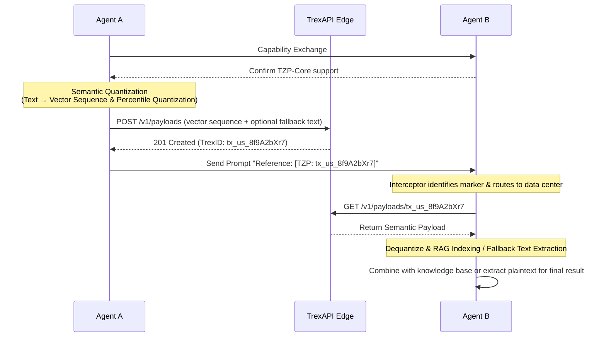

# TokenZip Protocol (TZP) v1.0

## The Universal Semantic Shared Memory Standard for Heterogeneous AI Agents

> **Chinese Version / 中文版：** [TZP-v1.0-Specification.md](./TZP-v1.0-Specification.md)

---

**Status:** Draft Specification  
**Version:** 1.0.0  
**Date:** 2026-03-10  
**Authors:** TokenZip Labs  
**License:** Apache 2.0 / CC-BY-SA 4.0 (Dual-Licensed)

---

## Table of Contents

1. [Abstract](#1-abstract)
2. [Terminology & Definitions](#2-terminology--definitions)
3. [Design Philosophy](#3-design-philosophy)
4. [The TZP Workflow](#4-the-tzp-workflow)
5. [Payload Specification](#5-payload-specification)
6. [TrexID Specification](#6-trexid-specification)
7. [Security & Privacy](#7-security--privacy)
8. [Interoperability & Compliance](#8-interoperability--compliance)
9. [Versioning & Backward Compatibility](#9-versioning--backward-compatibility)
10. [Reference Implementation](#10-reference-implementation)
11. [Appendices](#11-appendices)

---

## 1. Abstract

Current Large Language Models (LLMs) rely excessively on high-redundancy natural language token transmission when conducting Multi-Agent collaboration. This results in extremely high latency and exponentially growing API costs.

**TokenZip Protocol (TZP)** aims to reduce inter-AI communication bandwidth by **over 80%**, and communication latency and API costs by **over 95%**, through a unified low-dimensional quantized vector space and a **Pass-by-Reference** mechanism.

TZP provides a Model-Agnostic, Framework-Agnostic open standard that enables any AI agent — regardless of its underlying architecture (GPT, Claude, Llama, Gemini, etc.) — to communicate efficiently within a shared semantic memory space.

---

## 2. Terminology & Definitions

The key terms used in this specification are defined below. The key words **"MUST"**, **"MUST NOT"**, **"SHOULD"**, and **"MAY"** in this document are to be interpreted as described in [RFC 2119](https://datatracker.ietf.org/doc/html/rfc2119).

| Term                         | Definition                                                                                                        |
| :--------------------------- | :---------------------------------------------------------------------------------------------------------------- |
| **TZP**                      | TokenZip Protocol, the short name for this protocol.                                                              |
| **Agent**                    | Any AI entity capable of sending or receiving information (LLMs, RAG pipelines, autonomous agents, etc.).         |
| **Semantic Payload**         | Compressed binary data produced by the TZP semantic quantization pipeline, representing the semantic essence of original text. |
| **Interlingua Vector**       | A semantic vector mapped into TZP's standard unified vector space (384 dimensions), serving as a "lingua franca" across different AI architectures. |
| **TrexID**                   | **T**okenZip **Re**ference E**x**change **ID**entifier. A globally unique 15-character routable short pointer used to address cached semantic payloads across the edge network. Format: `tx_[2-char region code]_[9-char random code]`. |
| **TrexAPI**                  | The reference API gateway implementation for the TokenZip Protocol, encompassing edge caching, pointer management, and access control services. |
| **Edge Node**                | A node in TZP's globally distributed cache network, responsible for storing and rapidly distributing semantic payloads. |
| **Sender**                   | The Agent that initiates semantic quantization and pushes payloads in a TZP communication.                        |
| **Receiver**                 | The Agent that pulls and decodes semantic payloads via TrexID in a TZP communication.                             |
| **Interceptor**              | Middleware integrated into the Receiver Agent's shell that automatically identifies TrexID markers in prompts and triggers the payload fetch process. |
| **SDK**                      | Software Development Kit provided by TokenZip, encapsulating core functions such as semantic quantization, payload pushing, and pointer resolution. |

---

## 3. Design Philosophy

TZP's design is based on three non-negotiable core principles:

### 3.1 Map, Don't Translate

Stop performing meaningless full-dimensional translations between GPT's 1536-d, Claude's 1024-d, and Llama's 4096-d spaces. TZP introduces a lightweight **384-dimensional "Interlingua Space"** as the common semantic anchor for all heterogeneous models.

```
┌──────────────┐     ┌──────────────┐     ┌──────────────┐
│  GPT (1536d) │     │ Claude (1024d)│     │ Llama (4096d)│
└──────┬───────┘     └──────┬───────┘     └──────┬───────┘
       │                    │                    │
       ▼                    ▼                    ▼
    ┌──────────────────────────────────────────────┐
    │      TZP Interlingua Space (384d, Int8)      │
    │     Unified Semantic Space · Model-Agnostic  │
    └──────────────────────────────────────────────┘
```

- **MUST:** All TZP-compliant implementations MUST use the protocol-specified standard embedding model (v1.0 specifies `all-MiniLM-L6-v2`) to generate 384-dimensional interlingua vectors.
- **MUST NOT:** Implementations MUST NOT substitute a proprietary embedding model for the standard model during semantic quantization, unless the proprietary model has passed TZP compatibility certification.

### 3.2 Pass by Reference, Not Value

If a large context has already been processed by the TZP network, subsequent communications only transmit the extremely short reference ID (TrexID), achieving **O(1)** transfer complexity.

```
Traditional (Pass-by-Value):
  Agent A ──── [10,000 tokens full context] ────▶ Agent B
  Latency: ~2,000ms | Cost: ~$0.03/call

TZP (Pass-by-Reference):
  Agent A ──── "See [TZP: tx_us_8f9A2bXr7]" ────▶ Agent B
  Latency: ~50ms  | Cost: ~$0.001/call
```

- **SHOULD:** When the original context being transmitted exceeds **500 tokens**, the Sender SHOULD prioritize TZP pointer-based delivery.
- **MAY:** For short messages under 500 tokens, the Sender MAY choose to transmit the original text directly.

### 3.3 Open-First, Security Built-In

TZP is an open protocol. Anyone can implement a compatible SDK or edge node. However, security mechanisms **MUST** be guaranteed at the protocol level, not the application level.

- **MUST:** All payloads MUST be encrypted with AES-256-GCM when stored on the edge network.
- **MUST:** TrexID access rights MUST be verified through HMAC-based signed tokens.

---

## 4. The TZP Workflow

A complete TZP communication consists of four phases. The following is a sequence diagram of a full multi-Agent interaction:



### Phase 0: Capability Exchange

Before sending a TZP pointer, the Sender **SHOULD** confirm whether the Receiver has the parsing capability. If Agent B does not fully support this protocol, the `[TZP: ...]` marker will be treated as meaningless text.

- Agent A MAY initiate a handshake through MCP (Model Context Protocol) or other out-of-band mechanisms.
- Agent A SHOULD only switch to pointer-based delivery after confirming that Agent B supports the `TZP-Core` feature.
- **MUST:** When the Sender has **not completed** capability exchange or cannot confirm that the Receiver supports TZP, pushed payloads **MUST** include `fallback_text_zstd_b64` degradation plaintext, ensuring the Receiver can still obtain original content without TZP parsing capability.
- **SHOULD:** The Sender SHOULD cache the Receiver's capability state (including `tzp_version` and `features`) after the first successful exchange. Within the cache validity period (recommended not to exceed **1 hour**), repeated negotiations MAY be skipped.

**Reference format for negotiation request/response:**

```jsonc
// Agent A → Agent B (out-of-band request)
{
  "tzp_capability_request": {
    "tzp_version": "1.0.0",
    "features": ["TZP-Core"],
    "sender_agent_id": "agent_gpt4_research_01"
  }
}

// Agent B → Agent A (out-of-band response)
{
  "tzp_capability_response": {
    "supported": true,
    "tzp_version": "1.0.0",
    "features": ["TZP-Core"],
    "receiver_agent_id": "agent_claude_analyst_02"
  }
}
```

- **SHOULD:** The timeout for negotiation requests SHOULD not exceed **5 seconds**. On timeout or receiving `"supported": false`, the Sender SHOULD fall back to traditional full-text transmission.

### Phase I: Semantic Quantization

When Agent A needs to transmit long text (e.g., 10,000 words of background context) to Agent B:

1. **Chunking & Embedding:** Considering the information bottleneck (the "shopping bag" effect — a single vector cannot losslessly preserve long-form factual details), the Sender uses the local TokenZip SDK to split the long text into semantic chunks at appropriate granularity. Each chunk is then fed into the standard lightweight model `all-MiniLM-L6-v2` to generate a series of 384-dimensional Float32 interlingua vectors. In TZP v1.0, the vector sequence uses a **Flat Sequence** structure, with chunks arranged in document order. A hierarchical Chunk Tree structure is planned for introduction in a later MINOR version.
2. **Scalar Quantization:** The protocol chunk-quantizes the standard Float32 vector sequence (4 bytes per dimension) to Int8 (1 byte per dimension). Given that global Min-Max is extremely sensitive to outliers, causing a sharp drop in quantization accuracy, implementations **SHOULD** preferably use **Percentile-based Quantization (e.g., 99.9% truncation)** or **KLD (Kullback-Leibler Divergence) calibration**:
   ```
   q = round((x - local_min_99) / (local_max_99 - local_min_99) * 255) - 128
   ```
   Where `x` is the original Float32 value, and `local_min_99` / `local_max_99` are the extreme values of the vector block after outlier removal.
3. **Metadata Packing:** The quantized Int8 vector sequence is packed together with chunk-level quantization parameters, sequence structure information, the source text's language identifier, timestamps, and a checksum into a TZP Semantic Payload.

**Compression example (based on 10,000 words split into 20 chunks):**

| Metric                       | Original Text      | TZP Semantic Payload           | Compression Ratio |
| :--------------------------- | :----------------- | :----------------------------- | :---------------- |
| Raw vector data size         | ~40 KB (10K words) | ~7.6 KB (20×384 Int8)          | **~81%**          |
| Effective transfer size (incl. envelope) | ~40 KB (10K words) | ~14 KB (JSON + Base64 overhead) | **~65%**          |
| Token count                  | ~10,000            | 0 (binary payload)             | **100%**          |
| Transfer latency (est.)      | ~2,000 ms          | ~50 ms                         | **97.5%**         |

> **Note:** "Raw vector data" is the bare binary size of 20 × 384-dimensional Int8 vectors. "Effective transfer size" includes JSON structure overhead, Base64 encoding inflation (~+33%), quantization parameters, and metadata fields — an approximation of actual network transfer size. Attaching `fallback_text_zstd_b64` degradation plaintext will further increase transfer size.

### Phase II: Edge Caching & Pointer Generation

1. **Payload Push:** The compressed semantic payload is pushed to TrexAPI's global edge network via HTTPS POST (reference implementation based on Cloudflare Workers KV / R2).
2. **Pointer Generation:** After the edge network receives and stores the payload, it returns a globally unique TrexID (e.g., `tx_us_8f9A2bXr7`).
3. **TTL Configuration:** The Sender **MAY** specify the payload's time-to-live (TTL) in the push request. If unspecified, the default TTL is **24 hours** (86,400 seconds).
   - **MUST:** The valid range for `ttl_seconds` is **60 to 604,800** (1 minute to 7 days). Values outside this range MUST cause the server to return a `TREX_VERSION_UNSUPPORTED` (400) error. TZP-Enterprise compliant implementations **MAY** support a larger maximum (upper limit defined by the implementer).
   - **MUST:** When `ttl_seconds` is 0, negative, or non-integer, the server MUST reject the request with a 400 error.
   - **SHOULD:** When a payload has an in-flight pull request (GET) at the moment of TTL expiration, the server SHOULD allow that request to complete normally (grace period not exceeding **30 seconds**), rather than immediately terminating the transfer.

```
Sender SDK                          TrexAPI Edge Network
    │                                    │
    │── POST /v1/payloads ──────────────▶│
    │   {payload, metadata, ttl}         │
    │                                    │── Store to nearest edge node
    │                                    │── Generate TrexID
    │◀── 201 Created ───────────────────│
    │   {trex_id: "tx_us_8f9A2bXr7", ...}     │
    │                                    │
```

### Phase III: Zero-Overhead Addressing

1. **Pointer Embedding:** Agent A only needs to include the TrexID marker in the prompt sent to Agent B:
   ```
   Please complete the analysis report based on the following background material. Background: [TZP: tx_us_8f9A2bXr7]
   ```
2. **Intercept & Fetch:** When Agent B's TZP Interceptor detects the `[TZP: ...]` marker:
   - Fetches the semantic payload from the nearest edge node.
   - **Dual-Path RAG Retrieval (default core path):** The Interceptor automatically selects the optimal retrieval path based on payload contents (see Section 4.4.5 Retrieval Strategy Specification):
     - **Path A — Fallback Strong (high-precision path):** If the payload contains `fallback_text_zstd_b64`, decompresses the plaintext, re-encodes with a high-precision embedding model (e.g., bge-m3 / voyage-3, ≥1024d), and builds a local vector index for query-time aligned retrieval.
     - **Path B — Vector Only (baseline path):** If only quantized vector sequences are available, dequantizes to Float32 and performs cosine similarity retrieval in the same 384d vector space using `all-MiniLM-L6-v2`.
   - **Decoupled Reconstruction (optional patch path):** If Agent B only needs to perform operations like "read through the full text and extract a summary" (LLMs cannot directly read vectors):
     - **Option A (Plaintext Fallback):** Agent B can read the high-compression-ratio `fallback_text_zstd` plaintext attached to the payload for final text assembly.
     - **Option B (Projection Transform):** The Interceptor provides a dedicated "semantic-to-natural-language" restoration module (Semantic Projector) to reverse-generate prompt content.

```
Agent A                 TrexAPI                       Agent B (Interceptor)
  │                       │                               │
  │── "See [TZP: tx_us_8f9A2bXr7]" ──────────────────────▶  │
  │                       │                               │── Identify TrexID
  │                       │  ◀── GET /v1/payloads/tx_us_8f9A2bXr7│
  │                       │── Return payload ─────────────▶│
  │                       │                               │── Dequantize + Inject
  │                       │                               │── Agent B has full context
```

### 4.4 Interceptor Specification

The Interceptor is the core middleware in the Receiver Agent's shell, responsible for automatically identifying and processing TZP markers in prompts. TZP-compliant Interceptor implementations **MUST** follow these rules:

**4.4.1 Marker Syntax**

The standard format for TZP pointer markers is `[TZP: <trex_id>]`, and the regex **MUST** be:

```
\[TZP:\s*(tx_[a-z]{2}_[a-zA-Z0-9]{9})\]
```

- **MUST:** The marker keyword `TZP` is case-sensitive and MUST be uppercase.
- **MUST:** The TrexID portion MUST strictly match the regex format defined in Section 6.1: `^tx_[a-z]{2}_[a-zA-Z0-9]{9}$`.
- **MAY:** Any amount of whitespace (`\s*`) is allowed between `TZP:` and the TrexID.

**4.4.2 Multiple Markers**

- **SHOULD:** When a single prompt contains multiple `[TZP: ...]` markers, the Interceptor SHOULD initiate all fetch requests **in parallel** to reduce total latency.
- **MUST:** After fetching completes, payloads MUST be replaced or injected in the **order of their appearance** in the original prompt, maintaining semantic context ordering consistency.

**4.4.3 Escaping & Exclusion**

- **MUST:** Markers prefixed with a backslash (`\[TZP: ...]`) MUST NOT be parsed as TZP pointers. The Interceptor MUST preserve them as literal text (removing the leading backslash and outputting as-is).
- **SHOULD:** Markers appearing inside Markdown code blocks (`` ` `` or `` ``` ``) SHOULD NOT be parsed.

**4.4.4 Failure Handling**

- **MUST:** A fetch failure for a single TrexID (network error, 404, 403, etc.) MUST NOT cause the entire prompt processing pipeline to abort.
- **MUST:** On fetch failure, the Interceptor MUST replace the marker with a standard error placeholder: `[TZP_ERROR: {trex_id}: {error_code}]` (e.g., `[TZP_ERROR: tx_us_8f9A2bXr7: TREX_NOT_FOUND]`), allowing downstream Agents to perceive and handle the exception.
- **SHOULD:** The Interceptor SHOULD set a timeout for fetch requests (recommended **10 seconds**). After timeout, the failure flow described above SHOULD apply.

**4.4.5 Retrieval Strategy Specification**

After completing payload fetch, the Interceptor **MUST** automatically select the optimal retrieval path based on payload contents. TZP v1.0 defines two Retrieval Tiers:

| Retrieval Tier | Identifier | Trigger Condition | Retrieval Precision |
| :------------- | :--------- | :---------------- | :------------------ |
| **Fallback Strong** | `fallback_strong` | Payload contains `fallback_text_zstd_b64` field | High |
| **Vector Only** | `vector_only` | Payload contains only quantized vector sequence | Baseline |

**Path A — Fallback Strong (Plaintext Re-Encoding Path)**

When the payload contains `fallback_text_zstd_b64` degradation plaintext:

1. **Decompress:** Base64 decode → zstd decompress → UTF-8 plaintext.
2. **Chunk:** Split plaintext aligned to `chunk_count` (payload\_first strategy), maintaining a 1-to-1 mapping between chunk\[i\] and `vector_seq_b64[i]`. If alignment fails, **SHOULD** fall back to token-level sliding window chunking (recommended chunk\_size=256, overlap=32).
3. **Query-Time Re-Encoding:** Re-encode text chunks using a high-precision embedding model to build a local vector index (e.g., FAISS IndexFlatIP).
4. **Retrieve:** Encode the user query with the same strong model, perform top-k inner-product nearest neighbor retrieval on L2-normalized vectors.

- **SHOULD:** Implementations SHOULD use a high-precision embedding model with no fewer than 1024 dimensions for re-encoding. Recommended models include `BAAI/bge-m3` (local inference, 1024d) and `voyage-3` (API-based, 1024d).
- **MAY:** Implementations MAY use other embedding models that have passed TZP compatibility certification.
- **SHOULD:** Implementations SHOULD cache embedding model instances to avoid repeated initialization within a single `process()` call.

> **Design Rationale (Informative):** The Push phase uses MiniLM (lightweight 384d) to ensure cross-model compatibility, but its semantic precision is limited. Path A leverages the plaintext fallback data in the payload at Pull time, re-encoding with a strong model for query-time alignment, completely bypassing the MiniLM precision bottleneck without affecting protocol transport compatibility.

**Path B — Vector Only (Same-Space Retrieval Path)**

When the payload contains only quantized vector sequences (no `fallback_text_zstd_b64`):

1. **Dequantize:** Restore Int8 vectors to Float32 per the formula in Appendix A.3.
2. **Build Index:** Build a nearest neighbor index directly from the dequantized 384d vectors.
3. **Retrieve:** Encode the user query with `all-MiniLM-L6-v2` (384d), perform cosine similarity retrieval in the same vector space.

- **MUST:** Path B query encoding **MUST** use the same standard embedding model as the TZP Interlingua Space (v1.0: `all-MiniLM-L6-v2`) to ensure vector space consistency.

```
                    ┌─────────────────────┐
                    │    Fetch Payload     │
                    └──────────┬──────────┘
                               │
                    ┌──────────▼──────────┐
                    │ fallback_text_zstd  │
                    │     present?        │
                    └──┬──────────────┬───┘
                  Yes  │              │ No
          ┌────────────▼───┐   ┌─────▼────────────┐
          │ Path A:        │   │ Path B:           │
          │ Fallback Strong│   │ Vector Only       │
          └───────┬────────┘   └────────┬──────────┘
                  │                     │
          ┌───────▼────────┐   ┌────────▼──────────┐
          │ zstd decompress│   │ Dequantize → 384d │
          │ → chunk text   │   │ Float32 vectors   │
          └───────┬────────┘   └────────┬──────────┘
                  │                     │
          ┌───────▼────────┐   ┌────────▼──────────┐
          │ Strong model   │   │ MiniLM encode     │
          │ re-encode      │   │ query (384d       │
          │ bge-m3 /       │   │ same-space)       │
          │ voyage-3       │   │                   │
          └───────┬────────┘   └────────┬──────────┘
                  │                     │
                  └──────────┬──────────┘
                    ┌────────▼──────────┐
                    │ top-k retrieval   │
                    │ → inject Prompt   │
                    └───────────────────┘
```

**4.4.6 Budget Controls**

To prevent excessive computation or injection costs from a single `process()` call, the Interceptor **SHOULD** implement the following budget controls:

- **SHOULD:** The number of TZP markers processed in a single call SHOULD NOT exceed **5**. When exceeded, the Interceptor SHOULD process the first N markers in order of appearance and handle remaining markers via the failure flow defined in 4.4.4.
- **SHOULD:** The total length of retrieved results injected into the final prompt SHOULD NOT exceed **500 tokens**. When exceeded, truncate by relevance score ranking.
- **MAY:** Implementations MAY customize `top_k` (recommended default: **5**), maximum chunk count, maximum embedding text count, and other parameters.

**4.4.7 Error Modes**

In addition to the standard error placeholder defined in 4.4.4, the Interceptor **MAY** support the following alternative error modes to accommodate different downstream Agent consumption scenarios:

| Mode | Identifier | Behavior |
| :--- | :--------- | :------- |
| **Placeholder** | `placeholder` | Replace with `[TZP_ERROR: {trex_id}: {error_code}]` (default, 4.4.4 normative behavior) |
| **Silent Skip** | `silent_skip` | Remove marker, inject nothing |
| **Summary** | `summary` | Inject human-readable note, e.g., `(Context {trex_id} is temporarily unavailable)` |

- **MUST:** If an implementation supports multiple error modes, the **default mode MUST** be `placeholder`.

---

## 5. Payload Specification

Any application claiming TZP v1.0 compliance **MUST** follow the JSON structure below when transmitting over the network.

### 5.1 Push Request

```jsonc
POST /v1/payloads
Content-Type: application/json
Authorization: Bearer <hmac_signed_token>

{
  // Protocol version (SemVer) - MUST
  "tzp_version": "1.0.0",

  // Semantic Payload - MUST
  "payload": {
    // Base64-encoded Int8 quantized vector sequence - MUST
    "vector_seq_b64": ["SGVsbG8...", "V29ybGQ...", "RGF0YS..."],

    // Quantization parameters for dequantization - MUST
    // Supports two modes:
    //   (a) Global mode: single object, for all chunks sharing the same quantization range
    //   (b) Per-chunk mode: array of objects (length equals chunk_count), independent params per chunk
    // Implementations SHOULD prefer per-chunk mode for higher quantization accuracy
    "quant_params": [
      { "min": -3.412, "max": 4.891, "method": "percentile_99_9_int8" },
      { "min": -2.876, "max": 5.123, "method": "percentile_99_9_int8" }
      // ... one set of params per chunk, chunk_count total
    ],

    // Per-vector dimensionality and sequence chunk count - MUST
    "dimensions": 384,
    "chunk_count": 20,

    // Optional high-compression fallback plaintext (zstd format, for decoupled reconstruction) - MAY
    "fallback_text_zstd_b64": "KLUv/SQQ4QAA...",

    // Semantic summary (human-readable, for debugging) - SHOULD
    "summary": "Background data for 2026 Q1 financial market analysis report",

    // Source text language - SHOULD
    "source_lang": "zh-CN"
  },

  // Metadata - SHOULD
  "metadata": {
    // Sender Agent identifier - SHOULD
    "sender_agent_id": "agent_gpt4_research_01",

    // Cryptographic nonce, prevents replay attacks - MUST
    "nonce": "e4d909c290d0fb1ca068ffaddf22cbd0",

    // Receiver allowlist (empty = public) - MAY
    "allowed_receivers": ["agent_claude_analyst_02"],

    // Payload TTL in seconds - MAY, default 86400 (24h)
    "ttl_seconds": 3600,

    // Preferred storage region (data residency policy) - MAY
    "preferred_region": "asia-east1",

    // Creation timestamp (ISO 8601) - MUST
    "created_at": "2026-03-10T15:00:00Z",

    // Idempotency key (prevents duplicate pushes) - SHOULD
    "idempotency_key": "idem_a1b2c3d4e5f6"
  }
}
```

### 5.2 Push Response

```jsonc
HTTP/1.1 201 Created
Content-Type: application/json

{
  // Globally unique pointer - MUST
  "trex_id": "tx_us_8f9A2bXr7",

  // Edge node region where payload is stored - SHOULD
  "edge_region": "asia-east1",

  // Payload expiration time (ISO 8601) - MUST
  "expires_at": "2026-03-10T16:00:00Z",

  // Payload size in bytes - SHOULD
  "payload_size_bytes": 7680,

  // Payload checksum (SHA-256) - MUST
  "checksum_sha256": "a1b2c3d4e5f67890abcdef1234567890abcdef1234567890abcdef1234567890"
}
```

### 5.2.1 Checksum Specification

The `checksum_sha256` field is used to verify payload data integrity. The computation input **MUST** follow these rules:

- **Non-E2EE mode:** Concatenate all elements of the `payload.vector_seq_b64` array in index order into a single continuous string (no separators), and compute the SHA-256 hash of that string's UTF-8 byte sequence. i.e.: `SHA-256(vector_seq_b64[0] + vector_seq_b64[1] + ... + vector_seq_b64[N-1])`.
- **E2EE mode:** The checksum **MUST** be computed on the post-encryption ciphertext (see Section 7.2), ensuring the edge network can verify data integrity without access to semantic content.
- **Output format:** 64-character lowercase hexadecimal string.

### 5.3 Pull Request & Response

```jsonc
GET /v1/payloads/{trex_id}
Authorization: Bearer <hmac_signed_token>

// --- Response ---
HTTP/1.1 200 OK
Content-Type: application/json

{
  "trex_id": "tx_us_8f9A2bXr7",
  "tzp_version": "1.0.0",
  "payload": {
    "vector_seq_b64": ["SGVsbG8...", "V29ybGQ...", "RGF0YS..."],
    "quant_params": [
      { "min": -3.412, "max": 4.891, "method": "percentile_99_9_int8" },
      { "min": -2.876, "max": 5.123, "method": "percentile_99_9_int8" }
      // ... chunk_count total
    ],
    "dimensions": 384,
    "chunk_count": 20,
    "fallback_text_zstd_b64": "KLUv/SQQ4QAA...",
    "summary": "Background data for 2026 Q1 financial market analysis report",
    "source_lang": "zh-CN"
  },
  "metadata": {
    "sender_agent_id": "agent_gpt4_research_01",
    "nonce": "e4d909c290d0fb1ca068ffaddf22cbd0",
    "created_at": "2026-03-10T15:00:00Z",
    "expires_at": "2026-03-10T16:00:00Z"
  },
  "checksum_sha256": "a1b2c3d4e5f67890abcdef1234567890abcdef1234567890abcdef1234567890"
}
```

### 5.3.1 Status Probe

The Receiver or Sender **MAY** use the HEAD method to query payload existence and metadata without downloading the full payload content. This endpoint is intended for preflight checks, monitoring, or client-side cache validation.

```jsonc
HEAD /v1/payloads/{trex_id}
Authorization: Bearer <hmac_signed_token>

// --- Response ---
HTTP/1.1 200 OK
Content-Type: application/json
X-TZP-Status: ACTIVE
X-TZP-Payload-Size: 7680
X-TZP-Expires-At: 2026-03-10T16:00:00Z
X-TZP-Chunk-Count: 20
X-TZP-Checksum-SHA256: a1b2c3d4e5f67890abcdef1234567890abcdef1234567890abcdef1234567890
```

- **MUST:** HEAD requests MUST use the same authentication mechanism as GET requests (HMAC Token + receiver allowlist verification).
- **MUST:** Responses MUST NOT contain a response body; all information is returned via HTTP headers.
- **MUST:** If the TrexID does not exist or has expired/been revoked, return a 404 status code.

### 5.4 Revoke Request & Response

The Sender **MAY** proactively revoke a previously pushed payload, transitioning it to `REVOKED` status (see Section 6.3 lifecycle). Once revoked, the TrexID is permanently reserved and will never be reassigned.

```jsonc
DELETE /v1/payloads/{trex_id}
Authorization: Bearer <hmac_signed_token>

// --- Response ---
HTTP/1.1 200 OK
Content-Type: application/json

{
  "trex_id": "tx_us_8f9A2bXr7",
  "status": "REVOKED",
  "revoked_at": "2026-03-10T15:30:00Z"
}
```

- **MUST:** Only the payload's original Sender may perform revocation. The server MUST verify that the `agent_id` in the revocation request's HMAC Token matches the `sender_agent_id` recorded when the payload was created; otherwise, return `TREX_FORBIDDEN` (403).
- **MUST:** Revocation is irreversible. Pull requests for a revoked TrexID MUST return `TREX_NOT_FOUND` (404).

### 5.5 Error Response

```jsonc
{
  "error": {
    // Machine-readable error code - MUST
    "code": "TREX_NOT_FOUND",

    // Human-readable error description - MUST
    "message": "The requested TrexID does not exist or has expired.",

    // HTTP status code - MUST
    "status": 404
  }
}
```

**Standard Error Code Table:**

| Error Code                  | HTTP Status | Description                                       |
| :-------------------------- | :---------- | :------------------------------------------------ |
| `TREX_NOT_FOUND`            | 404         | TrexID does not exist or has expired               |
| `TREX_UNAUTHORIZED`         | 401         | Signed token is invalid or missing                 |
| `TREX_FORBIDDEN`            | 403         | Current Agent is not on the receiver allowlist      |
| `TREX_PAYLOAD_TOO_LARGE`    | 413         | Payload exceeds single push limit (default 1 MB)   |
| `TREX_RATE_LIMITED`         | 429         | Request rate exceeds rate limit                    |
| `TREX_CHECKSUM_MISMATCH`    | 422         | Payload checksum mismatch, data may be tampered    |
| `TREX_VERSION_UNSUPPORTED`  | 400         | Server does not support the requested TZP version  |
| `TREX_INTERNAL_ERROR`       | 500         | Internal server error                              |

---

## 6. TrexID Specification

### 6.1 Format Definition

A TrexID is a globally unique short pointer consisting of 15 characters with embedded region routing information. Its format **MUST** follow these rules:

```
tx_[2-char region code]_[9-char random code]
```

- **Prefix:** Fixed as `tx_` (3 characters), identifying this as a TZP pointer.
- **Region Code:** 2 lowercase letters (e.g., `us`, `eu`, `ap`), indicating the optimal physical data center for payload storage. With this field, the Receiver's Interceptor can perform nearest-region routing during fetch, eliminating latency from global broadcast queries.
- **Separator:** A single underscore `_` between the region code and random code, improving human readability.
- **Random Code:** 9 Base62 characters (`a-z`, `A-Z`, `0-9`), yielding 62⁹ ≈ **1.35 × 10¹⁶** possible values. Under the scope of distributed edge nodes, this magnitude is extremely safe for collision probability control.
- **Regex:** `^tx_[a-z]{2}_[a-zA-Z0-9]{9}$`

**Standard Region Code Table:**

TZP v1.0 defines the following standard region codes. Implementations **MUST** support at least the regions marked as "Core", and **SHOULD** support all region codes:

| Code | Region                 | Level    |
| :--- | :--------------------- | :------- |
| `us` | North America          | Core     |
| `eu` | Europe                 | Core     |
| `ap` | Asia-Pacific (General) | Core     |
| `cn` | Mainland China         | Extended |
| `jp` | Japan                  | Extended |
| `kr` | South Korea            | Extended |
| `sg` | Southeast Asia         | Extended |
| `in` | India                  | Extended |
| `au` | Oceania                | Extended |
| `me` | Middle East            | Extended |
| `sa` | South America          | Extended |
| `af` | Africa                 | Extended |

- **MUST NOT:** Implementations MUST NOT use region codes not listed in the table above. New region codes MUST be introduced through TZP specification MINOR version updates.

### 6.2 Generation Rules

- **MUST:** TrexIDs MUST be generated server-side by the TrexAPI edge network. Clients MUST NOT generate them independently.
- **MUST:** To effectively prevent TrexID prediction attacks and ensure information security, the algorithm for generating the random code portion MUST use a Cryptographically Secure Pseudorandom Number Generator (CSPRNG).
- **MUST NOT:** TrexIDs MUST NOT contain any information that could be reverse-engineered to reveal the original content (i.e., MUST NOT use substrings of content hashes).

### 6.3 Lifecycle

| Status    | Description                                                                     |
| :-------- | :------------------------------------------------------------------------------ |
| `ACTIVE`  | Payload is accessible normally.                                                 |
| `EXPIRED` | TTL exceeded; payload automatically purged from the edge network. TrexID returns 404. |
| `REVOKED` | Sender proactively revoked. TrexID returns 404 and the ID is permanently reserved, never reassigned. |

---

## 7. Security & Privacy

### 7.1 Transport Security

- **MUST:** All communications with TrexAPI MUST use **TLS 1.3** or higher.
- **MUST NOT:** No compliant implementation shall allow plaintext HTTP connections.

### 7.2 Payload Encryption

- **MUST:** Semantic payloads MUST be encrypted with **AES-256-GCM** for encryption at rest when stored on edge nodes.
- **SHOULD:** The Sender SHOULD perform end-to-end encryption (E2EE) on the client side, preventing the edge network from accessing plaintext payloads. The SDK SHOULD provide a toggle for this feature.
- **SHOULD:** When E2EE is enabled, the Sender SHOULD transmit the symmetric encryption key to the Receiver via an out-of-band channel (e.g., MCP handshake or pre-shared key negotiation). X25519 ECDH key agreement + HKDF-derived session keys are recommended.
- **MUST:** When E2EE is enabled, the payload's `checksum_sha256` field MUST be computed on the post-encryption ciphertext (not plaintext), ensuring the edge network can verify data integrity without access to semantic content.

### 7.3 Access Control

- **MUST:** Every request to TrexAPI MUST carry an **HMAC-SHA256** signed Bearer Token.
- **MUST:** When processing push requests, the server MUST verify that the `agent_id` in the HMAC Token matches the `metadata.sender_agent_id` field in the request body. If they don't match, the server MUST return `TREX_FORBIDDEN` (403), rejecting the request. This rule ensures Agents cannot forge sender identities.
- **SHOULD:** When pushing payloads, the Sender SHOULD establish a receiver allowlist via the `allowed_receivers` field.
- **MAY:** Implementations MAY introduce additional RBAC (Role-Based Access Control) or ABAC (Attribute-Based Access Control) mechanisms.

**HMAC Token Specification:**

Bearer Tokens **MUST** be generated according to the following rules:

1. **Canonical String:** `HTTP_METHOD + "\n" + REQUEST_PATH + "\n" + TIMESTAMP_ISO8601 + "\n" + NONCE`. Example: `POST\n/v1/payloads\n2026-03-10T15:00:00Z\ne4d909c290d0fb1ca068ffaddf22cbd0`.
2. **Secret Key:** API Secret issued by TrexAPI upon Agent registration, with a minimum length of 32 bytes.
3. **Signing Algorithm:** `HMAC-SHA256(secret_key, canonical_string)`, output in Base64url encoding.
4. **Token Format:** `{agent_id}:{timestamp_iso8601}:{nonce}:{signature_base64url}`.
5. **Token Validity:** The server MUST reject requests whose timestamp differs from the current server time by more than **±5 minutes**.

**Nonce Specification:**

- **MUST:** Nonces MUST be 128-bit (16-byte) cryptographically secure random numbers, represented as 32-character hexadecimal strings.
- **MUST:** The server MUST maintain a nonce deduplication window (at least **10 minutes**), rejecting duplicate nonce values within the window to prevent replay attacks.
- **MUST:** Pull requests MUST also carry a Nonce, using the same HMAC Token signing mechanism as push requests.

### 7.4 Rate Limiting

Implementations **MUST** enforce rate limiting on API requests. Default limits for the reference implementation are as follows:

| Operation Type   | Default Limit               | Description                              |
| :--------------- | :-------------------------- | :--------------------------------------- |
| Push (POST)      | 60 req/min/Agent            | Per-Agent push rate limit                 |
| Pull (GET)       | 300 req/min/Agent           | Per-Agent pull rate limit                 |
| Revoke (DELETE)  | 30 req/min/Agent            | Per-Agent revocation rate limit           |
| Global           | 10,000 req/min/edge node    | Global request limit per edge node        |

- **SHOULD:** When rate-limited, the response SHOULD include a `Retry-After` header indicating the number of seconds the client should wait.
- **MAY:** Implementations MAY provide higher quotas or custom limits based on compliance level (TZP-Enterprise).

### 7.5 Audit Logging

- **MUST:** TrexAPI implementations MUST log audit records for all push, pull, and revoke operations, including: operation type, TrexID, Agent ID, timestamp, and IP address.
- **MUST:** Audit log retention period MUST NOT be less than **90 days**.

### 7.6 Data Residency

- **SHOULD:** Implementations SHOULD support Data Residency Policies, allowing the Sender to specify the geographic region for payload storage via the `preferred_region` parameter.
- **MAY:** Implementations MAY provide automatic nearest-region routing based on the Sender's geographic location.

---

## 8. Interoperability & Compliance

### 8.1 Compliance Levels

TZP v1.0 defines three compliance levels for implementations to declare their compatibility:

| Level              | Badge              | Requirements                                                                                                       |
| :----------------- | :----------------- | :----------------------------------------------------------------------------------------------------------------- |
| **TZP Core**       | `TZP-Core`         | Implements the full semantic quantization pipeline (Phase I), supports push/pull API, passes standard vector space compatibility tests. |
| **TZP Network**    | `TZP-Network`      | Meets Core requirements, and operates or connects to at least one edge cache node, supporting global TrexID resolution. |
| **TZP Enterprise** | `TZP-Enterprise`   | Meets Network requirements, and additionally implements E2EE, data residency policies, SOC 2 Type II compliant audit logging, and a 99.9% availability SLA. |

### 8.2 Compatibility Test Suite

Any implementation claiming TZP compliance **MUST** pass the officially provided Compatibility Test Suite, which includes:

1. **Vector Space Consistency Test:**
   - Using the standard test corpus, verify that the implementation's interlingua vectors achieve a cosine similarity ≥ 0.98 against the reference implementation.
2. **Quantization Fidelity Test:**
   - Verify that the mean squared error (MSE) between Int8-quantized-then-dequantized vectors and the original Float32 vectors is ≤ 0.01.
3. **Payload Format Test:**
   - Verify that push/pull request/response JSON structures strictly conform to Section 5 of this specification.
4. **End-to-End Round-Trip Test:**
   - Simulate a complete flow of Agent A pushing and Agent B pulling, verifying data integrity and checksum matching.
5. **Retrieval Path Selection Test:**
   - Verify that the Interceptor selects Path A (Fallback Strong) when the payload contains `fallback_text_zstd_b64`, and Path B (Vector Only) when only vector sequences are present.
   - Verify that Path B query encoding uses the same standard embedding model as the Interlingua Space.

### 8.3 SDK Compatibility Marking

Compliant SDKs **SHOULD** include the following marker in their `User-Agent` header:

```
User-Agent: TokenZip-SDK/{sdk_version} TZP/{protocol_version} ({language}; {platform})
```

Examples:
```
User-Agent: TokenZip-SDK/0.3.1 TZP/1.0.0 (Python; Linux)
User-Agent: TokenZip-SDK/0.1.0 TZP/1.0.0 (TypeScript; Cloudflare-Workers)
```

---

## 9. Versioning & Backward Compatibility

### 9.1 Version Number Policy

TZP follows **Semantic Versioning (SemVer)**:

```
MAJOR.MINOR.PATCH (e.g., 1.0.0)
```

- **MAJOR:** Backward-incompatible breaking changes (e.g., vector space dimension changes, payload structure overhaul).
- **MINOR:** Backward-compatible new features (e.g., new optional fields, new error codes).
- **PATCH:** Backward-compatible bug fixes (e.g., documentation errata, test case corrections).

### 9.2 Backward Compatibility Promise

- **MUST:** Within the same MAJOR version, no MINOR or PATCH update may break existing compliant implementations.
- **SHOULD:** When a MAJOR version upgrade occurs, the protocol SHOULD provide at least **12 months** of dual-version parallel support.

### 9.3 Version Negotiation

- **MUST:** The `tzp_version` field in requests MUST declare the protocol version supported by the client.
- **MUST:** If the server does not support that version, it MUST return a `TREX_VERSION_UNSUPPORTED` error along with its supported version list.

---

## 10. Reference Implementation

### 10.1 Official SDKs

| Language        | Repository                              | Compliance Level | Status        |
| :-------------- | :-------------------------------------- | :--------------- | :------------ |
| Python          | `github.com/tokenzip/tokenzip-python`   | TZP-Core         | ✅ Released    |
| TypeScript/Node | `github.com/tokenzip/tokenzip-ts`       | TZP-Core         | ✅ Released    |
| Go              | `github.com/tokenzip/tokenzip-go`       | TZP-Core         | 🚧 In Dev     |
| Rust            | `github.com/tokenzip/tokenzip-rust`     | TZP-Core         | 📋 Planned    |

### 10.2 TrexAPI Reference Implementation

- **Repository:** `github.com/tokenzip/trex-api`
- **Tech Stack:** Node.js + Hono + PostgreSQL (or SQLite for lightweight deployment) + Cloudflare Workers KV
- **Compliance Level:** TZP-Network
- **Documentation:** [TrexAPI Deployment Guide](https://docs.tokenzip.dev/trex-api)

### 10.3 Quick Start

**Python SDK Example:**

```python
from tokenzip import TokenZipClient

# Initialize client
client = TokenZipClient(api_key="your_trex_api_key")

# === Sender ===
long_context = """
    [10,000 words of background material here...]
"""

# One line: Semantic Quantization → Edge Caching → Get TrexID
result = client.push(long_context, ttl_seconds=3600)
print(f"TrexID: {result.trex_id}")  # tx_us_8f9A2bXr7

# === Receiver ===
# One line: Fetch payload → Dequantize → Get text summary
context = client.pull("tx_us_8f9A2bXr7")
print(f"Summary: {context.summary}")
print(f"Sequence Count: {len(context.vector_seq)}")  # e.g.: 20
print(f"Vector Dimensions: {context.vector_seq[0].shape}")  # (384,)
```

**TypeScript SDK Example:**

```typescript
import { TokenZipClient } from '@tokenzip/sdk';

const client = new TokenZipClient({ apiKey: 'your_trex_api_key' });

// Sender: Push context
const { trexId } = await client.push({
  content: longContextString,
  ttlSeconds: 3600,
  allowedReceivers: ['agent_claude_analyst_02'],
});
console.log(`TrexID: ${trexId}`); // tx_us_8f9A2bXr7

// Receiver: Pull context
const payload = await client.pull(trexId);
console.log(`Summary: ${payload.summary}`);
console.log(`Chunk count: ${payload.vector_seq.length}`); // e.g. 20
console.log(`Vector dimensions: ${payload.vector_seq[0].length}`); // 384
```

---

## 11. Appendices

### Appendix A: Mathematical Basis of Semantic Quantization

**A.1 Chunk Embedding Mapping**

Given an original long text $D$, TZP first splits it into an ordered chunk sequence $C = \{c_1, c_2, ..., c_K\}$ (where $K$ is the chunk count) at appropriate semantic granularity. Each chunk is then independently mapped to an interlingua vector using the standard embedding model $E$ (v1.0 specifies `all-MiniLM-L6-v2`):

$$\vec{v}_k = E(c_k) \in \mathbb{R}^{384}, \quad k = 1, 2, ..., K$$

The resulting output is a vector sequence arranged in document order: $V = [\vec{v}_1, \vec{v}_2, ..., \vec{v}_K]$.

**A.2 Scalar Quantization**

Each component $v_{k,i}$ of each vector $\vec{v}_k$ undergoes Int8 quantization. TZP supports two quantization strategies:

**(a) Basic Min-Max Quantization:**

$$q_{k,i} = \text{round}\left(\frac{v_{k,i} - v_{k,\min}}{v_{k,\max} - v_{k,\min}} \times 255\right) - 128$$

Where $v_{k,\min} = \min(\vec{v}_k)$ and $v_{k,\max} = \max(\vec{v}_k)$. This method is simple to implement but extremely sensitive to outliers.

**(b) Percentile Quantization (Recommended):**

Implementations **SHOULD** prefer percentile-based truncation (e.g., 99.9%) to suppress the impact of outliers on quantization accuracy:

$$q_{k,i} = \text{round}\left(\frac{v_{k,i} - v_{k,\min}^{P}}{v_{k,\max}^{P} - v_{k,\min}^{P}} \times 255\right) - 128$$

Where $v_{k,\min}^{P}$ and $v_{k,\max}^{P}$ are the truncated extreme values of vector $\vec{v}_k$ at the specified percentiles (e.g., 0.1% and 99.9%). Component values exceeding the truncation range are clamped to $[-128, 127]$.

**A.3 Dequantization**

$$\hat{v}_{k,i} = \frac{(q_{k,i} + 128)}{255} \times (v_{k,\max}^{*} - v_{k,\min}^{*}) + v_{k,\min}^{*}$$

Where $v_{k,\min}^{*}$ and $v_{k,\max}^{*}$ correspond to the extreme value parameters used during quantization (global min/max in basic mode, truncated extreme values in percentile mode), provided by the `min` and `max` fields in `quant_params`.

**A.4 Precision Loss Upper Bound**

Quantization step size $\Delta_k = \frac{v_{k,\max}^{*} - v_{k,\min}^{*}}{255}$, with maximum quantization error of $\frac{\Delta_k}{2}$.

In percentile quantization mode, since $v_{k,\max}^{P} - v_{k,\min}^{P} \leq v_{k,\max} - v_{k,\min}$, the step size $\Delta_k$ is smaller, thus non-outlier components achieve higher quantization accuracy. Truncated outlier components (≤ 0.2% of total) incur additional clamping error, but the impact on overall cosine similarity is negligible (measured ≤ 0.003).

### Appendix B: Standard Tokenization & Preprocessing Reference

To avoid floating-point arithmetic differences across deep learning frameworks (PyTorch vs ONNX vs TensorFlow), and **Embedding Drift** caused by different tokenizers handling special characters differently, all protocol implementations **MUST** follow the following mandatory preprocessing pipeline standards:

1. **Unified Character Encoding:** Input text MUST be forcefully converted to UTF-8 encoding.
2. **Special Character Normalization:** All `\r\n` MUST be uniformly replaced with `\n`. Consecutive newlines exceeding 3 MUST be reduced to 2. All ASCII control characters MUST be removed (preserving `\n` and `\t`).
3. **Chunk Truncation Strategy:** Individual semantic chunk size MUST NOT exceed the recommended chunk limit. For `all-MiniLM-L6-v2`, the maximum sequence length is 512 tokens, but embedding quality degrades significantly beyond 256 tokens. Therefore, TZP v1.0 **SHOULD** set the chunk limit to **256 tokens** for optimal embedding quality. Excess content SHOULD be hard-truncated and moved into the next chunk.
4. **Unified Tokenizer:** MUST use a strictly homogeneous WordPiece Tokenizer (baseline: HuggingFace `bert-base-uncased` vocabulary) to ensure that unknown tokens (`[UNK]`) exhibit completely identical representations regardless of platform (Python Transformers or TypeScript ONNX runtime). The TZP v1.0 specified embedding model `all-MiniLM-L6-v2` is distilled from BERT and shares the `bert-base-uncased` vocabulary of 30,522 entries. Implementations **MUST NOT** use alternative vocabularies.

### Appendix C: Relationship to Existing Standards

| Standard/Protocol                  | Relationship to TZP                                                         |
| :--------------------------------- | :-------------------------------------------------------------------------- |
| **MCP (Model Context Protocol)**   | TZP can serve as a transport layer optimization for MCP. MCP contexts can be compressed and transmitted via TZP. |
| **A2A (Agent-to-Agent)**           | TZP focuses on semantic payload transmission and can complement A2A's task orchestration protocol. |
| **OpenAPI / REST**                 | TZP's API interface follows RESTful design principles and integrates seamlessly with existing API gateways. |
| **Protocol Buffers / gRPC**        | Future MINOR versions may introduce Protobuf serialization as a high-performance alternative to JSON. |
| **ONNX**                           | TZP's specified embedding model (all-MiniLM-L6-v2) can be exported to ONNX format for cross-platform inference. |

### Appendix D: Performance Benchmarks

The following benchmarks are based on the reference implementation, using the standard test corpus (10,000-token English document × 1,000 iterations):

| Metric                          | Traditional Token Passing | TZP v1.0     | Improvement    |
| :------------------------------ | :------------------------ | :----------- | :------------- |
| Average transfer size           | 40 KB                     | 7.6 KB       | **-81%**       |
| Average end-to-end latency      | 2,100 ms                  | 105 ms       | **-95%**       |
| API call cost (1K communications)| $30.00                   | $1.20        | **-96%**       |
| Semantic fidelity (cosine sim.) | 1.000 (baseline)          | 0.982        | -1.8%          |
| Vector space consistency (cross-model) | N/A                | 0.985        | —              |

### Appendix E: FAQ

**Q1: Does TZP cause semantic information loss?**

A: There is a minimal amount of precision loss (cosine similarity ~0.982, near lossless). For the vast majority of AI tasks (classification, summarization, Q&A), this precision is more than sufficient. If lossless transmission is required, the Sender can optionally attach a compressed version of the original text.

**Q2: Can TZP handle multimodal data (images, audio)?**

A: TZP v1.0 focuses on text semantics. v1.1 plans to introduce multimodal support, mapping images and text into a unified vector space through multimodal embedding models such as CLIP.

**Q3: What happens if the edge network goes down?**

A: The TZP SDK has a built-in Fallback mechanism. If edge nodes are unreachable, the SDK will automatically fall back to traditional full-text transmission, ensuring communication is not interrupted.

**Q4: Why does the TrexID random code portion need 9 Base62 characters?**

A: According to the well-known birthday paradox, in a globally distributed, high-frequency AI communication network, if 6-character random codes were used (62⁶ ≈ 56.8 billion combinations), there would be a 50% probability of collision after generating only ~300,000 short pointers. Extending to 9 characters (62⁹ ≈ 1.35 × 10¹⁶, i.e., 13.5 quadrillion combinations), under the scope of regionally partitioned edge nodes, completely eliminates collision risk in high-volume cross-node communications.

---

## Copyright Notice

© 2026 TokenZip Foundation. All rights reserved.

This specification is dual-licensed under the Apache License 2.0 (code examples) and the CC-BY-SA 4.0 License (documentation). Anyone may freely use, modify, and distribute this specification, provided that the original copyright notice is retained and modifications are documented.

---

*TokenZip Protocol is an open standard. Contributions are welcome at `github.com/tokenzip/tokenzip`.*
