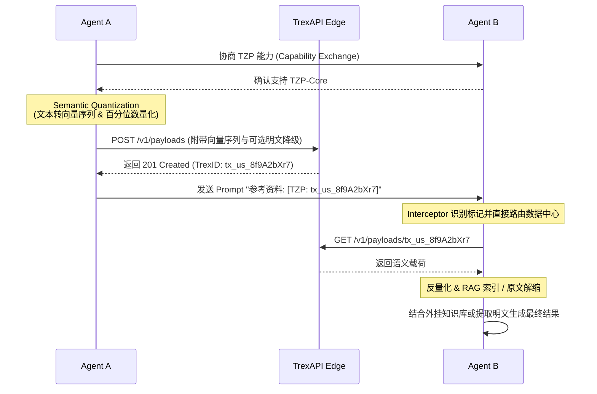

# TokenZip Protocol (TZP) v1.0

## The Universal Semantic Shared Memory Standard for Heterogeneous AI Agents

### 异构 AI 代理间的通用语义共享内存标准

> **English Version / 英文版：** [TZP-v1.0-Specification-EN.md](./TZP-v1.0-Specification-EN.md)

---

**Status:** Draft Specification  
**Version:** 1.0.0  
**Date:** 2026-03-10  
**Authors:** TokenZip Labs  
**License:** Apache 2.0 / CC-BY-SA 4.0 (Dual-Licensed)

---

## 目录 (Table of Contents)

1. [摘要 (Abstract)](#1-摘要-abstract)
2. [术语与定义 (Terminology & Definitions)](#2-术语与定义-terminology--definitions)
3. [核心哲学 (Design Philosophy)](#3-核心哲学-design-philosophy)
4. [协议生命周期 (The TZP Workflow)](#4-协议生命周期-the-tzp-workflow)
5. [标准数据包结构 (Payload Specification)](#5-标准数据包结构-payload-specification)
6. [TrexID 规范 (TrexID Specification)](#6-trexid-规范-trexid-specification)
7. [安全与隐私 (Security & Privacy)](#7-安全与隐私-security--privacy)
8. [互操作性与合规性 (Interoperability & Compliance)](#8-互操作性与合规性-interoperability--compliance)
9. [版本控制与向后兼容 (Versioning & Backward Compatibility)](#9-版本控制与向后兼容-versioning--backward-compatibility)
10. [参考实现 (Reference Implementation)](#10-参考实现-reference-implementation)
11. [附录 (Appendices)](#11-附录-appendices)

---

## 1. 摘要 (Abstract)

当前的大语言模型（LLMs）在进行多智能体（Multi-Agent）协作时，过度依赖高冗余的自然语言 Token 传输。这导致了极高的延迟和指数级增长的 API 成本。

**TokenZip Protocol (TZP)** 旨在通过统一的低维量化向量空间和**指针传递机制（Pass-by-Reference）**，将 AI 间的通信带宽**降低 80% 以上**，通信延迟和 API 成本**降低 95% 以上**。

TZP 提供一套与模型无关（Model-Agnostic）、与框架无关（Framework-Agnostic）的开放标准，使任何 AI 代理——无论其底层架构（GPT、Claude、Llama、Gemini 等）——都能在一个共享的语义内存空间中高效通信。

---

## 2. 术语与定义 (Terminology & Definitions)

本规范中使用的关键术语定义如下。文中关键字 **"必须 (MUST)"**、**"不得 (MUST NOT)"**、**"应当 (SHOULD)"**、**"可以 (MAY)"** 的解释遵循 [RFC 2119](https://datatracker.ietf.org/doc/html/rfc2119) 的规范。

| 术语 (Term)              | 定义 (Definition)                                                                                                |
| :----------------------- | :--------------------------------------------------------------------------------------------------------------- |
| **TZP**                  | TokenZip Protocol，本协议的简称。                                                                                   |
| **Agent**                | 任何可以发送或接收信息的 AI 实体（LLM、RAG 管道、自治代理等）。                                                              |
| **语义载荷 (Semantic Payload)** | 经过 TZP 语义量化流程处理后的压缩二进制数据，代表原始文本的语义本质。                                                         |
| **中间态向量 (Interlingua Vector)** | 映射到 TZP 标准统一向量空间（384 维）中的语义向量，充当不同 AI 架构之间的"世界语"。                                       |
| **TrexID**               | **T**okenZip **Re**ference E**x**change **ID**entifier。一个全局唯一的 15 位字符可路由短指针，用于在边缘网络中寻址已缓存的语义载荷。格式：`tx_[2位区域码]_[9位随机码]`。 |
| **TrexAPI**              | TokenZip 协议的参考 API 网关实现，包含边缘缓存、指针管理和权限控制等核心服务。                                                 |
| **边缘节点 (Edge Node)**    | TZP 全球分布式缓存网络中的一个节点，负责存储和快速分发语义载荷。                                                               |
| **发送方 (Sender)**         | 在一次 TZP 通信中发起语义量化并推送载荷的 Agent。                                                                       |
| **接收方 (Receiver)**       | 在一次 TZP 通信中通过 TrexID 拉取并解码语义载荷的 Agent。                                                               |
| **拦截器 (Interceptor)**    | 集成在接收方 Agent 外壳中的中间件，自动识别提示词中的 TrexID 标记并触发载荷拉取流程。                                             |
| **SDK**                  | TokenZip 提供的软件开发工具包，封装了语义量化、载荷推送、指针解析等核心功能。                                                      |

---

## 3. 核心哲学 (Design Philosophy)

TZP 的设计基于三项不可协商的核心原则：

### 3.1 不翻译，只映射 (Map, Don't Translate)

停止在 GPT 的 1536 维、Claude 的 1024 维和 Llama 的 4096 维之间进行无意义的全维度翻译。TZP 引入了一个轻量级的 **384 维 "世界语" 向量空间（Interlingua Space）**，作为所有异构模型的公共语义锚点。

```
┌──────────────┐     ┌──────────────┐     ┌──────────────┐
│  GPT (1536d) │     │ Claude (1024d)│     │ Llama (4096d)│
└──────┬───────┘     └──────┬───────┘     └──────┬───────┘
       │                    │                    │
       ▼                    ▼                    ▼
    ┌──────────────────────────────────────────────┐
    │      TZP Interlingua Space (384d, Int8)      │
    │       统一语义向量空间 · 模型无关              │
    └──────────────────────────────────────────────┘
```

- **必须 (MUST):** 所有兼容 TZP 的实现，必须使用协议指定的标准嵌入模型（v1.0 指定为 `all-MiniLM-L6-v2`）生成 384 维中间态向量。
- **不得 (MUST NOT):** 实现方不得使用私有嵌入模型替代标准模型进行语义量化，除非该私有模型已通过 TZP 兼容性认证。

### 3.2 传指针，不传值 (Pass by Reference, Not Value)

如果一个庞大的上下文已经被 TZP 网络处理过，后续通信只传递极短的引用 ID（TrexID），实现 **O(1)** 的传输复杂度。

```
传统方式 (Pass-by-Value):
  Agent A ──── [10,000 tokens 完整上下文] ────▶ Agent B
  延迟: ~2,000ms | 成本: ~$0.03/次

TZP 方式 (Pass-by-Reference):
  Agent A ──── "参考 [TZP: tx_us_8f9A2bXr7]" ────▶ Agent B
  延迟: ~50ms  | 成本: ~$0.001/次
```

- **应当 (SHOULD):** 当传递的原始上下文超过 **500 tokens** 时，发送方应当优先使用 TZP 指针传递。
- **可以 (MAY):** 对于低于 500 tokens 的短消息，发送方可以选择直接传递原文。

### 3.3 开放优先，安全内建 (Open-First, Security Built-In)

TZP 是一个开放协议。任何人都可以实现兼容的 SDK 或边缘节点。但安全机制**必须**从协议层而非应用层保障。

- **必须 (MUST):** 所有载荷在边缘网络中必须以 AES-256-GCM 加密存储。
- **必须 (MUST):** TrexID 的访问权限必须通过基于 HMAC 的签名令牌进行验证。

---

## 4. 协议生命周期 (The TZP Workflow)

一次完整的 TZP 通信包含四个阶段。以下是多 Agent 间完整交互的时序图：



### 阶段 0: 能力协商 (Capability Exchange)

在发送 TZP 指针前，发送方 **应当 (SHOULD)** 确认接收方是否具备解析能力。若 Agent B 不完全支持此协议，`[TZP: ...]` 将被直接当作无意义文本处理。
- Agent A 可通过 MCP (Model Context Protocol) 或其他带外机制（Out-of-band）发起握手。
- 只有在确认 Agent B 支持 `TZP-Core` 特性后，Agent A 才会切换为指针传递机制。
- **必须 (MUST):** 当发送方**未完成**能力协商或无法确认接收方支持 TZP 时，推送载荷**必须**附带 `fallback_text_zstd_b64` 降级明文，以确保接收方在不具备 TZP 解析能力时仍可获取原始内容。
- **应当 (SHOULD):** 发送方应当在首次成功协商后缓存接收方的能力状态（含 `tzp_version` 和 `features`），在缓存有效期内（建议不超过 **1 小时**）可跳过重复协商。

**协商请求/响应参考格式：**

```jsonc
// Agent A → Agent B (带外请求)
{
  "tzp_capability_request": {
    "tzp_version": "1.0.0",
    "features": ["TZP-Core"],
    "sender_agent_id": "agent_gpt4_research_01"
  }
}

// Agent B → Agent A (带外响应)
{
  "tzp_capability_response": {
    "supported": true,
    "tzp_version": "1.0.0",
    "features": ["TZP-Core"],
    "receiver_agent_id": "agent_claude_analyst_02"
  }
}
```

- **应当 (SHOULD):** 协商请求的超时时间应当不超过 **5 秒**。超时或收到 `"supported": false` 时，发送方应当回退到传统全文本传输。

### 阶段 I: 语义提取与量化 (Semantic Quantization)

当 Agent A 需要向 Agent B 传递长文本（如 10,000 字的背景上下文）时：

1. **语义分块与映射 (Chunking & Embedding):** 考虑到信息论瓶颈（“乐购购物袋”效应，即单一向量无法无损保留长篇事实细节），发送方通过本地的 TokenZip SDK，将长文本按合适的粒度进行语义分块。随后将每个内容块输入标准的轻量级模型 `all-MiniLM-L6-v2`，生成一系列 384 维的 Float32 中间态向量。TZP v1.0 中向量序列采用**扁平数组（Flat Sequence）** 结构，各块按文档中的出现顺序排列。层级化的块树（Chunk Tree）结构计划在后续 MINOR 版本中引入。
2. **标量量化 (Scalar Quantization):** 协议将标准的 Float32 向量序列（每维 4 字节）分块量化为 Int8（每维 1 字节）。考虑到全局 Min-Max 对离群值（Outliers）极其敏感，进而导致量化精度骤降，实现方 **应当 (SHOULD)** 优先使用 **基于百分位数的量化 (Percentile-based Quantization, 例如 99.9% 截断)** 或 **KLD (Kullback-Leibler Divergence) 校准**：
   ```
   q = round((x - local_min_99) / (local_max_99 - local_min_99) * 255) - 128
   ```
   其中 `x` 为原始 Float32 值，`local_min_99` 和 `local_max_99` 为该向量块剔除离群值后的极值。
3. **元数据打包 (Metadata Packing):** 量化后的 Int8 向量序列与分块量化参数、序列结构信息、原始文本的语言标识、时间戳及校验和一起打包为 TZP 语义载荷。

**压缩效果示例 (以 10,000 字分为 20 个 Chunk 计算):**

| 指标               | 原始文本          | TZP 语义载荷                 | 压缩率      |
| :----------------- | :--------------- | :-------------------------- | :---------- |
| 纯向量数据大小       | ~40 KB (10K 字)  | ~7.6 KB (20×384 Int8)       | **~81%**    |
| 有效传输大小 (含封装) | ~40 KB (10K 字)  | ~14 KB (JSON + Base64 膨胀)  | **~65%**    |
| Token 数           | ~10,000          | 0 (二进制载荷)               | **100%**    |
| 传输延迟 (估算)      | ~2,000 ms        | ~50 ms                      | **97.5%**   |

> **注：** "纯向量数据"为 20 个 384 维 Int8 向量的裸二进制大小。"有效传输大小"包含 JSON 结构开销、Base64 编码膨胀（约 +33%）、量化参数及元数据字段，为实际网络传输的近似值。若附带 `fallback_text_zstd_b64` 降级明文，传输大小将进一步增加。

### 阶段 II: 边缘缓存与指针生成 (Edge Caching & Pointer Generation)

1. **载荷推送 (Payload Push):** 压缩后的语义载荷通过 HTTPS POST 请求推送到 TrexAPI 的全球边缘网络（参考实现基于 Cloudflare Workers KV / R2）。
2. **指针生成 (Pointer Generation):** 边缘网络接收并存储载荷后，返回一个全局唯一的 TrexID（例如：`tx_us_8f9A2bXr7`）。
3. **TTL 设置 (TTL Configuration):** 发送方**可以 (MAY)** 在推送请求中指定载荷的生存时间（TTL）。若未指定，默认 TTL 为 **24 小时**（86,400 秒）。
   - **必须 (MUST):** `ttl_seconds` 的合法范围为 **60 至 604,800**（1 分钟 至 7 天）。超出此范围的值，服务端**必须**返回 `TREX_VERSION_UNSUPPORTED` (400) 错误。TZP-Enterprise 合规等级的实现方**可以 (MAY)** 支持更大的最大值（上限由实现方定义）。
   - **必须 (MUST):** `ttl_seconds` 为 0、负数或非整数时，服务端**必须**拒绝该请求并返回 400 错误。
   - **应当 (SHOULD):** 当载荷在 TTL 到期瞬间有正在进行中的拉取请求（GET）时，服务端**应当**允许该请求正常完成（宽限期不超过 **30 秒**），而非立即中断传输。

```
发送方 SDK                          TrexAPI 边缘网络
    │                                    │
    │── POST /v1/payloads ──────────────▶│
    │   {payload, metadata, ttl}         │
    │                                    │── 存储到最近边缘节点
    │                                    │── 生成 TrexID
    │◀── 201 Created ───────────────────│
    │   {trex_id: "tx_us_8f9A2bXr7", ...}     │
    │                                    │
```

### 阶段 III: 零负担寻址 (Zero-Overhead Addressing)

1. **指针嵌入 (Pointer Embedding):** Agent A 在发给 Agent B 的提示词中，仅需包含 TrexID 标记：
   ```
   请根据以下背景资料完成分析报告。背景资料：[TZP: tx_us_8f9A2bXr7]
   ```
2. **拦截与拉取 (Intercept & Fetch):** Agent B 的 TZP 拦截器（Interceptor）识别到 `[TZP: ...]` 标记后：
   - 从最近的边缘节点拉取语义载荷。
   - 将 Int8 向量序列反量化为 Float32 中间态向量序列。
   - **执行 RAG 索引模式 (默认核心路径):** 将向量序列存入接收方的本地内存或向量引擎，作为检索增强生成（RAG）的知识源。当 Agent 遇到 `[TZP: ...]` 时，拦截器自动将原始上下文查询转换为对该向量空间的检索操作。
   - **执行解耦重建 (Decoupled Reconstruction，可选补丁方案):** 若 Agent B 只需要进行如“通读全文并提取摘要”的操作（LLM 无法直接阅读向量本身）：
     - **方案 A (明文回退):** Agent B 可根据场景读取附加在载荷中高压比的 `fallback_text_zstd` 明文，进行最后的文字拼接以供阅读。
     - **方案 B (投影转换):** Interceptor 提供一个专门用于“语义到自然语言”的还原模块 (Semantic Projector) 反推生成提示词内容。

```
Agent A                 TrexAPI                       Agent B (拦截器)
  │                       │                               │
  │── "参考 [TZP: tx_us_8f9A2bXr7]" ──────────────────────▶  │
  │                       │                               │── 识别 TrexID
  │                       │  ◀── GET /v1/payloads/tx_us_8f9A2bXr7│
  │                       │── 返回载荷 ──────────────────▶│
  │                       │                               │── 反量化 + 注入
  │                       │                               │── Agent B 获得完整上下文
```

### 4.4 拦截器行为规范 (Interceptor Specification)

拦截器（Interceptor）是接收方 Agent 外壳中的核心中间件，负责自动识别和处理提示词中的 TZP 标记。兼容 TZP 的 Interceptor 实现**必须 (MUST)** 遵循以下规则：

**4.4.1 标记语法 (Marker Syntax)**

TZP 指针标记的标准格式为 `[TZP: <trex_id>]`，其正则表达式**必须**为：

```
\[TZP:\s*(tx_[a-z]{2}_[a-zA-Z0-9]{9})\]
```

- **必须 (MUST):** 标记关键字 `TZP` 大小写敏感，必须为全大写。
- **必须 (MUST):** TrexID 部分必须严格匹配 6.1 节定义的正则格式 `^tx_[a-z]{2}_[a-zA-Z0-9]{9}$`。
- **可以 (MAY):** `TZP:` 与 TrexID 之间允许任意数量的空白字符（`\s*`）。

**4.4.2 多标记处理 (Multiple Markers)**

- **应当 (SHOULD):** 当单个提示词中包含多个 `[TZP: ...]` 标记时，Interceptor 应当**并行**发起所有拉取请求以降低总延迟。
- **必须 (MUST):** 拉取完成后，各载荷必须按标记在原始提示词中的**出现顺序**进行替换或注入，保持语义上下文的顺序一致性。

**4.4.3 转义与排除 (Escaping & Exclusion)**

- **必须 (MUST):** 以反斜杠前缀的标记 `\[TZP: ...]` 不得被解析为 TZP 指针，Interceptor 必须将其作为字面文本保留（移除前导反斜杠后原样输出）。
- **应当 (SHOULD):** 出现在 Markdown 代码块（`` ` `` 或 `` ``` ``）内部的标记不应被解析。

**4.4.4 失败处理 (Failure Handling)**

- **必须 (MUST):** 单个 TrexID 的拉取失败（网络错误、404、403 等）**不得**导致整个提示词处理流程中断。
- **必须 (MUST):** 拉取失败时，Interceptor 必须将该标记替换为标准错误占位符：`[TZP_ERROR: {trex_id}: {error_code}]`（例如：`[TZP_ERROR: tx_us_8f9A2bXr7: TREX_NOT_FOUND]`），使下游 Agent 可感知并处理该异常。
- **应当 (SHOULD):** Interceptor 应当对拉取请求设置超时（建议 **10 秒**），超时后按上述失败流程处理。

---

## 5. 标准数据包结构 (Payload Specification)

任何声称兼容 TZP v1.0 的应用，在网络层传输时**必须 (MUST)** 遵循以下 JSON 结构。

### 5.1 推送请求 (Push Request)

```jsonc
POST /v1/payloads
Content-Type: application/json
Authorization: Bearer <hmac_signed_token>

{
  // 协议版本 (遵循 SemVer) - 必须 (MUST)
  "tzp_version": "1.0.0",

  // 语义载荷 - 必须 (MUST)
  "payload": {
    // Base64 编码的 Int8 量化向量序列 (Sequence of Vectors) - 必须 (MUST)
    "vector_seq_b64": ["SGVsbG8...", "V29ybGQ...", "RGF0YS..."],

    // 量化参数，用于反量化 - 必须 (MUST)
    // 支持两种模式：
    //   (a) 全局模式：单个对象，适用于所有 chunk 共享同一量化范围
    //   (b) 分块模式：对象数组（长度等于 chunk_count），每个 chunk 独立量化参数
    // 实现方应当 (SHOULD) 优先使用分块模式以获得更高的量化精度
    "quant_params": [
      { "min": -3.412, "max": 4.891, "method": "percentile_99_9_int8" },
      { "min": -2.876, "max": 5.123, "method": "percentile_99_9_int8" }
      // ... 每个 chunk 一组参数，共 chunk_count 个
    ],

    // 单向量维度及序列块数 - 必须 (MUST)
    "dimensions": 384,
    "chunk_count": 20,

    // 可选的高压解码明文（zstd 格式，用于解耦重建） - 可以 (MAY)
    "fallback_text_zstd_b64": "KLUv/SQQ4QAA...",

    // 语义摘要 (人类可读，用于调试) - 应当 (SHOULD)
    "summary": "2026Q1 金融市场分析报告的背景数据",

    // 原始文本的语言 - 应当 (SHOULD)
    "source_lang": "zh-CN"
  },

  // 元数据 - 应当 (SHOULD)
  "metadata": {
    // 发送方 Agent 标识 - 应当 (SHOULD)
    "sender_agent_id": "agent_gpt4_research_01",

    // 安全随机数，防重放攻击 (Replay Attack) - 必须 (MUST)
    "nonce": "e4d909c290d0fb1ca068ffaddf22cbd0",

    // 接收方白名单 (为空则公开) - 可以 (MAY)
    "allowed_receivers": ["agent_claude_analyst_02"],

    // 载荷生存时间（秒） - 可以 (MAY), 默认 86400 (24h)
    "ttl_seconds": 3600,

    // 首选存储区域（数据驻留策略） - 可以 (MAY)
    "preferred_region": "asia-east1",

    // 创建时间戳 (ISO 8601) - 必须 (MUST)
    "created_at": "2026-03-10T15:00:00Z",

    // 幂等键 (防止重复推送) - 应当 (SHOULD)
    "idempotency_key": "idem_a1b2c3d4e5f6"
  }
}
```

### 5.2 推送响应 (Push Response)

```jsonc
HTTP/1.1 201 Created
Content-Type: application/json

{
  // 全局唯一指针 - 必须 (MUST)
  "trex_id": "tx_us_8f9A2bXr7",

  // 载荷存储的边缘节点区域 - 应当 (SHOULD)
  "edge_region": "asia-east1",

  // 载荷过期时间 (ISO 8601) - 必须 (MUST)
  "expires_at": "2026-03-10T16:00:00Z",

  // 载荷大小 (字节) - 应当 (SHOULD)
  "payload_size_bytes": 7680,

  // 载荷校验和 (SHA-256) - 必须 (MUST)
  "checksum_sha256": "a1b2c3d4e5f67890abcdef1234567890abcdef1234567890abcdef1234567890"
}
```

### 5.2.1 校验和计算规范 (Checksum Specification)

`checksum_sha256` 字段用于验证载荷数据的完整性。其计算输入**必须 (MUST)** 遵循以下规则：

- **非 E2EE 模式：** 将 `payload.vector_seq_b64` 数组中的所有元素按索引顺序直接拼接为一个连续字符串（无分隔符），对该字符串的 UTF-8 字节序列计算 SHA-256 哈希值。即：`SHA-256(vector_seq_b64[0] + vector_seq_b64[1] + ... + vector_seq_b64[N-1])`。
- **E2EE 模式：** 校验和**必须**基于加密后的密文计算（参见 7.2 节），以确保边缘网络可验证数据完整性但无法获取语义内容。
- **输出格式：** 64 位小写十六进制字符串。

### 5.3 拉取请求与响应 (Pull Request & Response)

```jsonc
GET /v1/payloads/{trex_id}
Authorization: Bearer <hmac_signed_token>

// --- 响应 ---
HTTP/1.1 200 OK
Content-Type: application/json

{
  "trex_id": "tx_us_8f9A2bXr7",
  "tzp_version": "1.0.0",
  "payload": {
    "vector_seq_b64": ["SGVsbG8...", "V29ybGQ...", "RGF0YS..."],
    "quant_params": [
      { "min": -3.412, "max": 4.891, "method": "percentile_99_9_int8" },
      { "min": -2.876, "max": 5.123, "method": "percentile_99_9_int8" }
      // ... 共 chunk_count 个
    ],
    "dimensions": 384,
    "chunk_count": 20,
    "fallback_text_zstd_b64": "KLUv/SQQ4QAA...",
    "summary": "2026Q1 金融市场分析报告的背景数据",
    "source_lang": "zh-CN"
  },
  "metadata": {
    "sender_agent_id": "agent_gpt4_research_01",
    "nonce": "e4d909c290d0fb1ca068ffaddf22cbd0",
    "created_at": "2026-03-10T15:00:00Z",
    "expires_at": "2026-03-10T16:00:00Z"
  },
  "checksum_sha256": "a1b2c3d4e5f67890abcdef1234567890abcdef1234567890abcdef1234567890"
}
```

### 5.3.1 状态查询 (Status Probe)

接收方或发送方**可以 (MAY)** 使用 HEAD 方法查询载荷的存在性和元数据，而不下载完整载荷内容。此接口用于预检、监控或客户端缓存验证。

```jsonc
HEAD /v1/payloads/{trex_id}
Authorization: Bearer <hmac_signed_token>

// --- 响应 ---
HTTP/1.1 200 OK
Content-Type: application/json
X-TZP-Status: ACTIVE
X-TZP-Payload-Size: 7680
X-TZP-Expires-At: 2026-03-10T16:00:00Z
X-TZP-Chunk-Count: 20
X-TZP-Checksum-SHA256: a1b2c3d4e5f67890abcdef1234567890abcdef1234567890abcdef1234567890
```

- **必须 (MUST):** HEAD 请求的鉴权机制与 GET 请求相同（HMAC Token + 接收方白名单校验）。
- **必须 (MUST):** 响应**不得**包含响应体（Body），所有信息通过 HTTP 头返回。
- **必须 (MUST):** 若 TrexID 不存在或已过期/撤销，返回 404 状态码。

### 5.4 撤销请求与响应 (Revoke Request & Response)

发送方**可以 (MAY)** 主动撤销已推送的载荷，使其进入 `REVOKED` 状态（参见 6.3 节生命周期）。撤销后，该 TrexID 永久保留且不再被分配。

```jsonc
DELETE /v1/payloads/{trex_id}
Authorization: Bearer <hmac_signed_token>

// --- 响应 ---
HTTP/1.1 200 OK
Content-Type: application/json

{
  "trex_id": "tx_us_8f9A2bXr7",
  "status": "REVOKED",
  "revoked_at": "2026-03-10T15:30:00Z"
}
```

- **必须 (MUST):** 仅载荷的原始发送方可执行撤销操作。服务端**必须**校验撤销请求的 HMAC Token 中的 `agent_id` 与该载荷创建时记录的 `sender_agent_id` 一致，否则返回 `TREX_FORBIDDEN` (403)。
- **必须 (MUST):** 撤销操作不可逆。对已撤销的 TrexID 执行拉取请求，服务端**必须**返回 `TREX_NOT_FOUND` (404)。

### 5.5 错误响应 (Error Response)

```jsonc
{
  "error": {
    // 机器可读的错误码 - 必须 (MUST)
    "code": "TREX_NOT_FOUND",

    // 人类可读的错误描述 - 必须 (MUST)
    "message": "The requested TrexID does not exist or has expired.",

    // HTTP 状态码 - 必须 (MUST)
    "status": 404
  }
}
```

**标准错误码表：**

| 错误码 (Code)              | HTTP 状态码 | 描述 (Description)                        |
| :------------------------ | :--------- | :---------------------------------------- |
| `TREX_NOT_FOUND`          | 404        | TrexID 不存在或已过期                        |
| `TREX_UNAUTHORIZED`       | 401        | 签名令牌无效或缺失                            |
| `TREX_FORBIDDEN`          | 403        | 当前 Agent 不在接收方白名单中                  |
| `TREX_PAYLOAD_TOO_LARGE`  | 413        | 载荷超过单次推送上限（默认 1 MB）                |
| `TREX_RATE_LIMITED`       | 429        | 请求频率超过速率限制                            |
| `TREX_CHECKSUM_MISMATCH`  | 422        | 载荷校验和不匹配，数据可能被篡改                  |
| `TREX_VERSION_UNSUPPORTED`| 400        | 服务端不支持请求中的 TZP 版本                    |
| `TREX_INTERNAL_ERROR`     | 500        | 服务端内部错误                                |

---

## 6. TrexID 规范 (TrexID Specification)

### 6.1 格式定义

TrexID 是一个由 15 个字符组成的、包含区域路由信息的全局唯一短指针，其格式**必须**遵循以下规则：

```
tx_[2位区域码]_[9位随机码]
```

- **前缀:** 固定为 `tx_`（3 个字符），用于标识这是一个 TZP 指针。
- **区域码 (Region Code):** 2 位小写字母（例如 `us`, `eu`, `ap`），用于指示载荷存储的最佳物理数据中心。受惠于此字段，接收方 Interceptor 在拉取时可直接进行就近路由，消除全球广播查询带来的延迟。
- **分隔符:** 区域码与随机码之间固定使用一个下划线 `_` 分隔，以提升人类可读性。
- **随机码部分:** 9 位 Base62 字符（`a-z`, `A-Z`, `0-9`），产生 62⁹ ≈ **1.35 × 10¹⁶** 个可能值。在分布式的边缘节点作用域下，此量级在控制碰撞概率上极为安全。
- **正则表达式:** `^tx_[a-z]{2}_[a-zA-Z0-9]{9}$`

**标准区域码表 (Standard Region Codes):**

TZP v1.0 定义以下标准区域码。实现方**必须 (MUST)** 至少支持标记为"核心"的区域码，**应当 (SHOULD)** 支持全部区域码：

| 区域码 | 区域名称 (Region)      | 级别   |
| :---- | :--------------------- | :----- |
| `us`  | 北美 (North America)    | 核心   |
| `eu`  | 欧洲 (Europe)           | 核心   |
| `ap`  | 亚太通用 (Asia-Pacific)  | 核心   |
| `cn`  | 中国大陆 (China)         | 扩展   |
| `jp`  | 日本 (Japan)            | 扩展   |
| `kr`  | 韩国 (South Korea)      | 扩展   |
| `sg`  | 东南亚 (Southeast Asia)  | 扩展   |
| `in`  | 印度 (India)            | 扩展   |
| `au`  | 大洋洲 (Oceania)        | 扩展   |
| `me`  | 中东 (Middle East)      | 扩展   |
| `sa`  | 南美 (South America)    | 扩展   |
| `af`  | 非洲 (Africa)           | 扩展   |

- **不得 (MUST NOT):** 实现方不得使用上表之外的区域码。新增区域码必须通过 TZP 规范的 MINOR 版本更新引入。

### 6.2 生成规则

- **必须 (MUST):** TrexID 必须由 TrexAPI 边缘网络在服务器端侧生成，客户端**不得**自行生成。
- **必须 (MUST):** 为有效防止 TrexID 预测攻击，保障信息安全，生成随机码部分的算法**必须**采用加密安全伪随机数生成器 (CSPRNG, Cryptographically Secure Pseudorandom Number Generator)。
- **不得 (MUST NOT):** TrexID 不得包含任何可被逆向推导出原始内容的信息（即不得使用内容哈希值的子串）。

### 6.3 生命周期

| 状态 (Status) | 描述 (Description)                                        |
| :----------- | :-------------------------------------------------------- |
| `ACTIVE`     | 载荷可被正常访问。                                           |
| `EXPIRED`    | 超过 TTL，载荷自动从边缘网络清除。TrexID 返回 404。             |
| `REVOKED`    | 发送方主动撤销。TrexID 返回 404 且此 ID 永久保留，不再被分配。  |

---

## 7. 安全与隐私 (Security & Privacy)

### 7.1 传输安全 (Transport Security)

- **必须 (MUST):** 所有与 TrexAPI 的通信必须使用 **TLS 1.3** 或更高版本。
- **不得 (MUST NOT):** 任何兼容实现不得允许明文 HTTP 连接。

### 7.2 载荷加密 (Payload Encryption)

- **必须 (MUST):** 语义载荷在边缘节点存储时，必须使用 **AES-256-GCM** 进行静态加密（Encryption at Rest）。
- **应当 (SHOULD):** 发送方应当在客户端侧进行端到端加密（E2EE），使边缘网络无法获取明文载荷。SDK 应当提供此功能的开关。
- **应当 (SHOULD):** 启用 E2EE 时，发送方应当通过带外通道（如 MCP 握手或预共享密钥协商）将对称加密密钥传递给接收方。推荐使用 X25519 ECDH 密钥协商 + HKDF 派生会话密钥。
- **必须 (MUST):** 启用 E2EE 时，载荷的 `checksum_sha256` 字段**必须**基于加密后的密文计算（而非明文），以确保边缘网络可验证数据完整性但无法获取语义内容。

### 7.3 访问控制 (Access Control)

- **必须 (MUST):** 每次对 TrexAPI 的请求都必须携带一个基于 **HMAC-SHA256** 签名的 Bearer Token。
- **必须 (MUST):** 服务端在处理推送请求时，**必须**验证 HMAC Token 中的 `agent_id` 与请求体 `metadata.sender_agent_id` 字段一致。若不一致，服务端**必须**返回 `TREX_FORBIDDEN` (403) 错误，拒绝该请求。此规则确保 Agent 不能伪造发送方身份。
- **应当 (SHOULD):** 推送载荷时，发送方应当通过 `allowed_receivers` 字段建立接收方白名单。
- **可以 (MAY):** 实现方可以引入额外的 RBAC（基于角色的访问控制）或 ABAC（基于属性的访问控制）机制。

**HMAC Token 规范：**

Bearer Token **必须 (MUST)** 按以下规则生成：

1. **签名消息体 (Canonical String):** `HTTP_METHOD + "\n" + REQUEST_PATH + "\n" + TIMESTAMP_ISO8601 + "\n" + NONCE`。例如：`POST\n/v1/payloads\n2026-03-10T15:00:00Z\ne4d909c290d0fb1ca068ffaddf22cbd0`。
2. **签名密钥 (Secret Key):** 由 TrexAPI 在 Agent 注册时颁发的 API Secret，长度**必须**不少于 32 字节。
3. **签名算法:** `HMAC-SHA256(secret_key, canonical_string)`，输出 Base64url 编码。
4. **Token 格式:** `{agent_id}:{timestamp_iso8601}:{nonce}:{signature_base64url}`。
5. **Token 有效期:** 服务端**必须**拒绝时间戳与当前服务器时间差超过 **±5 分钟** 的请求。

**Nonce 规范：**

- **必须 (MUST):** Nonce 为 128 位（16 字节）的加密安全随机数，以 32 位十六进制字符串表示。
- **必须 (MUST):** 服务端必须维护一个 Nonce 去重窗口（至少 **10 分钟**），在窗口内拒绝重复的 Nonce 值以防止重放攻击。
- **必须 (MUST):** 拉取请求同样需要携带 Nonce，使用与推送请求相同的 HMAC Token 签名机制。

### 7.4 速率限制 (Rate Limiting)

实现方**必须 (MUST)** 对 API 请求实施速率限制。参考实现的默认限值如下：

| 操作类型          | 默认限值                  | 说明                                  |
| :--------------- | :----------------------- | :------------------------------------ |
| 推送 (POST)      | 60 次/分钟/Agent          | 单个 Agent 的推送频率上限               |
| 拉取 (GET)       | 300 次/分钟/Agent         | 单个 Agent 的拉取频率上限               |
| 撤销 (DELETE)    | 30 次/分钟/Agent          | 单个 Agent 的撤销频率上限               |
| 全局 (Global)    | 10,000 次/分钟/边缘节点    | 单个边缘节点的全局请求上限              |

- **应当 (SHOULD):** 超限时，响应**应当**包含 `Retry-After` 头，指示客户端等待的秒数。
- **可以 (MAY):** 实现方可以根据合规等级（TZP-Enterprise）提供更高的配额或自定义限值。

### 7.5 审计日志 (Audit Logging)

- **必须 (MUST):** TrexAPI 的实现必须记录所有推送、拉取和撤销操作的审计日志，包含：操作类型、TrexID、Agent ID、时间戳和 IP 地址。
- **必须 (MUST):** 审计日志的保留期限不得少于 **90 天**。

### 7.6 数据驻留 (Data Residency)

- **应当 (SHOULD):** 实现方应当支持数据驻留策略（Data Residency Policy），允许发送方通过 `preferred_region` 参数指定载荷存储的地理区域。
- **可以 (MAY):** 实现方可以提供自动就近路由，基于发送方的地理位置选择最近的边缘节点。

---

## 8. 互操作性与合规性 (Interoperability & Compliance)

### 8.1 合规分级 (Compliance Levels)

TZP v1.0 定义了三个合规等级，供实现方声明其兼容程度：

| 等级 (Level)        | 标识 (Badge)       | 要求 (Requirements)                                                                                               |
| :----------------- | :----------------- | :---------------------------------------------------------------------------------------------------------------- |
| **TZP Core**       | `TZP-Core`         | 实现完整的语义量化流程（阶段 I），支持推送/拉取 API，通过标准向量空间兼容性测试。                                                  |
| **TZP Network**    | `TZP-Network`      | 满足 Core 要求，并自行运营或接入至少一个边缘缓存节点，支持 TrexID 的全球解析。                                                  |
| **TZP Enterprise** | `TZP-Enterprise`   | 满足 Network 要求，并额外实现 E2EE、数据驻留策略、SOC 2 Type II 合规审计日志、以及 99.9% 可用性 SLA。                            |

### 8.2 兼容性测试套件 (Compatibility Test Suite)

任何声称兼容 TZP 的实现**必须 (MUST)** 通过官方提供的兼容性测试套件（Test Suite），测试项包括：

1. **向量空间一致性测试 (Vector Space Consistency Test):**
   - 使用标准测试语料库，验证实现方生成的中间态向量与参考实现的余弦相似度 ≥ 0.98。
2. **量化精度测试 (Quantization Fidelity Test):**
   - 验证 Int8 量化后反量化的向量与原始 Float32 向量的均方误差 (MSE) ≤ 0.01。
3. **数据包格式测试 (Payload Format Test):**
   - 验证推送/拉取请求/响应的 JSON 结构严格符合本规范第 5 节。
4. **端到端往返测试 (End-to-End Round-Trip Test):**
   - 模拟 Agent A 推送、Agent B 拉取的完整流程，验证数据完整性和校验和匹配。

### 8.3 SDK 兼容性标记 (SDK Compatibility Marking)

兼容的 SDK **应当 (SHOULD)** 在其 `User-Agent` 头中包含以下标记：

```
User-Agent: TokenZip-SDK/{sdk_version} TZP/{protocol_version} ({language}; {platform})
```

示例:
```
User-Agent: TokenZip-SDK/0.3.1 TZP/1.0.0 (Python; Linux)
User-Agent: TokenZip-SDK/0.1.0 TZP/1.0.0 (TypeScript; Cloudflare-Workers)
```

---

## 9. 版本控制与向后兼容 (Versioning & Backward Compatibility)

### 9.1 版本号策略

TZP 遵循**语义化版本号（Semantic Versioning, SemVer）**：

```
MAJOR.MINOR.PATCH (e.g., 1.0.0)
```

- **MAJOR:** 存在不向后兼容的破坏性变更（如向量空间维度变更、数据包结构重构）。
- **MINOR:** 新增向后兼容的功能（如新增可选字段、新增错误码）。
- **PATCH:** 向后兼容的问题修复（如文档勘误、测试用例修正）。

### 9.2 向后兼容承诺

- **必须 (MUST):** 在同一 MAJOR 版本内，任何 MINOR 或 PATCH 更新不得破坏已有的合规实现。
- **应当 (SHOULD):** 当 MAJOR 版本升级时，协议应当提供至少 **12 个月** 的双版本并行支持期。

### 9.3 版本协商 (Version Negotiation)

- **必须 (MUST):** 请求中的 `tzp_version` 字段必须声明客户端支持的协议版本。
- **必须 (MUST):** 服务端若不支持该版本，必须返回 `TREX_VERSION_UNSUPPORTED` 错误及其支持的版本列表。

---

## 10. 参考实现 (Reference Implementation)

### 10.1 官方 SDK

| 语言 (Language)  | 仓库 (Repository)                          | 合规等级        | 状态 (Status)  |
| :-------------- | :----------------------------------------- | :------------- | :------------ |
| Python          | `github.com/tokenzip/tokenzip-python`      | TZP-Core       | ✅ 已发布       |
| TypeScript/Node | `github.com/tokenzip/tokenzip-ts`          | TZP-Core       | ✅ 已发布       |
| Go              | `github.com/tokenzip/tokenzip-go`          | TZP-Core       | 🚧 开发中      |
| Rust            | `github.com/tokenzip/tokenzip-rust`        | TZP-Core       | 📋 计划中      |

### 10.2 TrexAPI 参考实现

- **仓库:** `github.com/tokenzip/trex-api`
- **技术栈:** Node.js + Hono + PostgreSQL（或 SQLite 用于轻量部署）+ Cloudflare Workers KV
- **合规等级:** TZP-Network
- **文档:** [TrexAPI 部署指南](https://docs.tokenzip.dev/trex-api)

### 10.3 快速开始 (Quick Start)

**Python SDK 示例:**

```python
from tokenzip import TokenZipClient

# 初始化客户端
client = TokenZipClient(api_key="your_trex_api_key")

# === 发送方 ===
long_context = """
    [此处为 10,000 字的背景资料...]
"""

# 一行代码完成：语义量化 → 边缘缓存 → 获取 TrexID
result = client.push(long_context, ttl_seconds=3600)
print(f"TrexID: {result.trex_id}")  # tx_us_8f9A2bXr7

# === 接收方 ===
# 一行代码完成：拉取载荷 → 反量化 → 获取文本摘要
context = client.pull("tx_us_8f9A2bXr7")
print(f"语义摘要: {context.summary}")
print(f"特征块数量 (Sequence Count): {len(context.vector_seq)}")  # 例如: 20
print(f"单向量维度: {context.vector_seq[0].shape}")  # (384,)
```

**TypeScript SDK 示例:**

```typescript
import { TokenZipClient } from '@tokenzip/sdk';

const client = new TokenZipClient({ apiKey: 'your_trex_api_key' });

// 发送方：推送上下文
const { trexId } = await client.push({
  content: longContextString,
  ttlSeconds: 3600,
  allowedReceivers: ['agent_claude_analyst_02'],
});
console.log(`TrexID: ${trexId}`); // tx_us_8f9A2bXr7

// 接收方：拉取上下文
const payload = await client.pull(trexId);
console.log(`Summary: ${payload.summary}`);
console.log(`Chunk count: ${payload.vector_seq.length}`); // e.g. 20
console.log(`Vector dimensions: ${payload.vector_seq[0].length}`); // 384
```

---

## 11. 附录 (Appendices)

### 附录 A: 语义量化数学基础 (Mathematical Basis of Semantic Quantization)

**A.1 分块嵌入映射**

给定原始长文本 $D$，TZP 首先将其按语义粒度分割为有序块序列 $C = \{c_1, c_2, ..., c_K\}$（其中 $K$ 为 chunk 数量）。随后使用标准嵌入模型 $E$（v1.0 指定为 `all-MiniLM-L6-v2`）将每个块独立映射为中间态向量：

$$\vec{v}_k = E(c_k) \in \mathbb{R}^{384}, \quad k = 1, 2, ..., K$$

最终产出按文档顺序排列的向量序列 $V = [\vec{v}_1, \vec{v}_2, ..., \vec{v}_K]$。

**A.2 标量量化**

对每个向量 $\vec{v}_k$ 的每个分量 $v_{k,i}$ 进行 Int8 量化。TZP 支持两种量化策略：

**(a) 基础 Min-Max 量化：**

$$q_{k,i} = \text{round}\left(\frac{v_{k,i} - v_{k,\min}}{v_{k,\max} - v_{k,\min}} \times 255\right) - 128$$

其中 $v_{k,\min} = \min(\vec{v}_k)$，$v_{k,\max} = \max(\vec{v}_k)$。此方法实现简单，但对离群值（Outliers）极其敏感。

**(b) 百分位数量化（推荐）：**

实现方**应当 (SHOULD)** 优先使用基于百分位数截断（例如 99.9%）的量化方法，以抑制离群值对量化精度的影响：

$$q_{k,i} = \text{round}\left(\frac{v_{k,i} - v_{k,\min}^{P}}{v_{k,\max}^{P} - v_{k,\min}^{P}} \times 255\right) - 128$$

其中 $v_{k,\min}^{P}$ 和 $v_{k,\max}^{P}$ 分别为向量 $\vec{v}_k$ 在指定百分位数（如 0.1% 和 99.9%）处的截断极值。超出截断范围的分量值将被 clamp 至 $[-128, 127]$。

**A.3 反量化**

$$\hat{v}_{k,i} = \frac{(q_{k,i} + 128)}{255} \times (v_{k,\max}^{*} - v_{k,\min}^{*}) + v_{k,\min}^{*}$$

其中 $v_{k,\min}^{*}$ 和 $v_{k,\max}^{*}$ 对应量化时使用的极值参数（基础模式下为全局 min/max，百分位数模式下为截断极值），由 `quant_params` 中的 `min` 和 `max` 字段提供。

**A.4 精度损失上界**

量化步长 $\Delta_k = \frac{v_{k,\max}^{*} - v_{k,\min}^{*}}{255}$，最大量化误差为 $\frac{\Delta_k}{2}$。

在百分位数量化模式下，由于 $v_{k,\max}^{P} - v_{k,\min}^{P} \leq v_{k,\max} - v_{k,\min}$，步长 $\Delta_k$ 更小，因此非离群分量的量化精度更高。被截断的离群分量（占比 ≤ 0.2%）会产生额外的 clamp 误差，但对整体余弦相似度的影响可忽略（实测 ≤ 0.003）。

### 附录 B: 标准分词与预处理规范 (Standard Tokenization Reference)

为避免不同深度学习框架 (PyTorch vs ONNX vs TensorFlow) 的浮点数运算差异，以及不同分词器 (Tokenizer) 在处理特殊字符时产生的**向量空间漂移 (Embedding Drift)**，协议各实现方在此**必须 (MUST)** 遵循如下强制的预处理管线标准：

1. **统一字符编码:** 输入文本必须强制转换为 UTF-8 编码。
2. **特殊字符标准化:** 所有 `\r\n` 统一替换为 `\n`。连续超过 3 个的换行符缩减为 2 个。且移除所有 ASCII 的控制字符 (保留 `\n` 和 `\t`)。
3. **分集截断策略 (Truncation):** 单个语义分块 (Chunk) 大小不可超过推荐分块上限。对于 `all-MiniLM-L6-v2`，其最大序列长度为 512 tokens，但超过 256 tokens 后嵌入质量显著下降，因此 TZP v1.0 **应当 (SHOULD)** 将分块上限设为 **256 tokens** 以获得最佳嵌入质量。超出的多余部分应当作硬性截断移入下一分块。
4. **统一分词器 (Tokenizer):** 必须使用严格同质的大表 WordPiece Tokenizer (基准为 HuggingFace `bert-base-uncased` 词表)，以确保无论是 Python (Transformers) 还是 TS (ONNX runtime)，转义未知词元 (`[UNK]`) 均呈现完全一致的表征。TZP v1.0 指定的嵌入模型 `all-MiniLM-L6-v2` 基于 BERT 蒸馏，共享 `bert-base-uncased` 的 30,522 条词表。实现方**不得 (MUST NOT)** 使用其他词表进行替代。

### 附录 C: 与现有标准的关系 (Relationship to Existing Standards)

| 标准/协议                    | 与 TZP 的关系                                                        |
| :-------------------------- | :------------------------------------------------------------------ |
| **MCP (Model Context Protocol)** | TZP 可作为 MCP 的传输层优化。MCP 的上下文可通过 TZP 压缩后传递。             |
| **A2A (Agent-to-Agent)**          | TZP 专注于语义载荷传输，可与 A2A 的任务编排协议互补使用。                     |
| **OpenAPI / REST**                | TZP 的 API 接口遵循 RESTful 设计原则，可与现有 API 网关无缝集成。            |
| **Protocol Buffers / gRPC**       | 未来 MINOR 版本可能引入 Protobuf 序列化作为 JSON 的高性能替代方案。           |
| **ONNX**                          | TZP 指定的嵌入模型（all-MiniLM-L6-v2）可导出为 ONNX 格式，实现跨平台推理。   |

### 附录 D: 性能基准测试 (Performance Benchmarks)

以下基准测试基于参考实现，使用标准测试语料库（10,000 token 英文文档 × 1,000 次）：

| 指标 (Metric)                  | 传统 Token 传递 | TZP v1.0     | 改善幅度        |
| :---------------------------- | :------------- | :----------- | :------------- |
| 平均传输大小                     | 40 KB          | 7.6 KB       | **-81%**       |
| 平均端到端延迟                   | 2,100 ms       | 105 ms       | **-95%**       |
| API 调用成本 (1K 次通信)         | $30.00         | $1.20        | **-96%**       |
| 语义保真度 (余弦相似度)           | 1.000 (基准)    | 0.982        | -1.8%          |
| 向量空间一致性 (跨模型)           | N/A            | 0.985        | —              |

### 附录 E: FAQ (常见问题)

**Q1: TZP 是否会导致语义信息丢失？**

A: 会有极微量的精度损失（余弦相似度约 0.982，接近无损）。对于绝大多数 AI 任务（分类、摘要、问答），该精度完全足够。如需无损传输，发送方可选择同时附加原始文本的压缩版本。

**Q2: TZP 能处理多模态数据（图像、音频）吗？**

A: TZP v1.0 专注于文本语义。v1.1 计划引入多模态支持，通过 CLIP 等多模态嵌入模型将图像和文本统一映射到同一向量空间。

**Q3: 如果边缘网络宕机怎么办？**

A: TZP SDK 内建了 Fallback 机制。若边缘节点不可达，SDK 将自动回退到传统的全文本传输，确保通信不中断。

**Q4: 为什么 TrexID 的随机码部分需要 9 位 Base62 字符？**

A: 根据著名的生日悖论，在一个全球分布式、高频通信的 AI 网络中，如果采用 6 位随机码（62⁶ ≈ 568 亿组合），只要生成约 30 万个随机短指针就有 50% 的概率发生碰撞。扩展到 9 位后（62⁹ ≈ 1.35 × 10¹⁶，即 1.35 京个组合），在按区域分片的边缘节点作用域下，完全消除了海量跨节点通信的碰撞风险。

---

## 版权声明 (Copyright Notice)

© 2026 TokenZip Foundation. All rights reserved.

本规范按照 Apache 2.0 许可证（代码示例部分）和 CC-BY-SA 4.0 许可证（文档部分）进行双重授权。任何人均可自由使用、修改和分发本规范，前提是保留原始版权声明并注明修改内容。

---

*TokenZip Protocol is an open standard. Contributions are welcome at `github.com/tokenzip/tokenzip`.*
